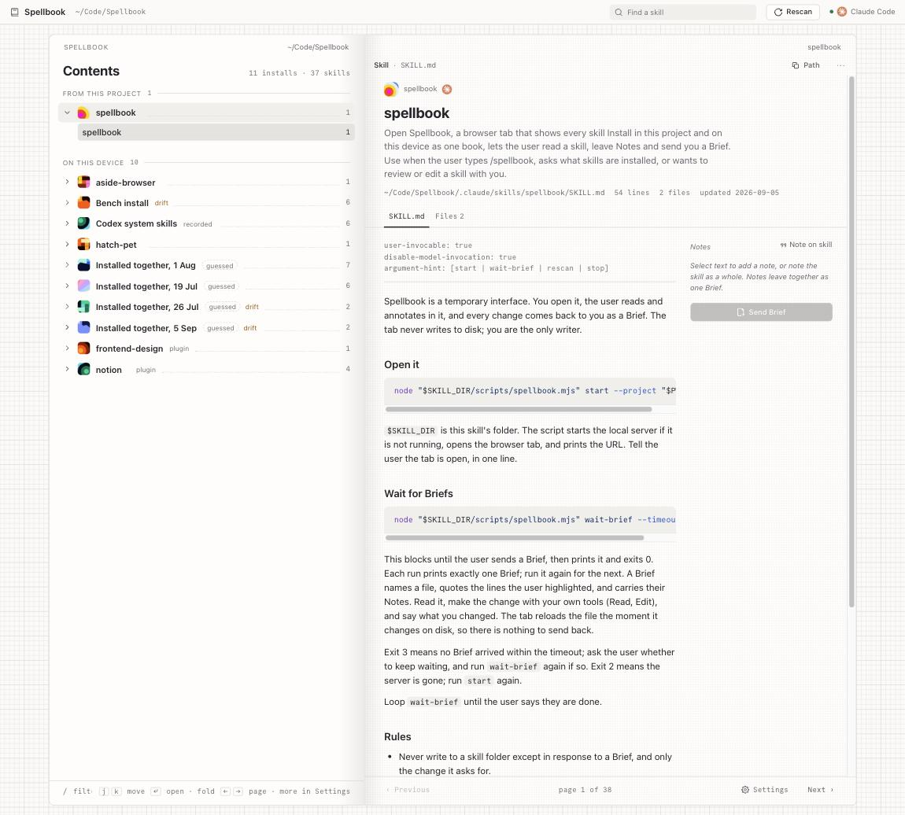

<pre align="center">
███████  ██████   ███████  ██       ██       ██████    █████    █████   ██   ██
██       ██   ██  ██       ██       ██       ██   ██  ██   ██  ██   ██  ██  ██ 
███████  ██████   █████    ██       ██       ██████   ██   ██  ██   ██  █████  
     ██  ██       ██       ██       ██       ██   ██  ██   ██  ██   ██  ██  ██ 
███████  ██       ███████  ███████  ███████  ██████    █████    █████   ██   ██

      every skill install on the machine, as one book

╭───────────────────────────╮╭───────────────────────────╮
│  Contents                 ││  spellbook                │
│                           ││                           │
│  FROM THIS PROJECT      1 ││  Read a skill. Select a   │
│  ▪ spellbook ·········· 1 ││  passage and leave a      │
│                           ││  Note. Send the Brief.    │
│  ON THIS DEVICE        10 ││                           │
│  ▪ Bench · pack ······· 6 ││  The agent edits the      │
│  ▪ Codex system ······· 6 ││  file; the page reloads.  │
│  ▪ emilkowalski/skills  7 ││  The tab never writes.    │
╰───────────────────────────╯╰───────────────────────────╯
</pre>

# Spellbook

Every skill Install on your machine as one book, opened by your coding agent from a skill.



Type `/spellbook` in Claude Code (or run the launcher from Codex or any other agent). A browser
tab opens on a two-page spread. The left page is the contents: every Install, grouped by Source
("From this project", then "On this device"), with its skills as entries and page numbers. The
right page is the Reader: one skill's Markdown, with a Notes margin. Select a passage, write a
Note, press **Send Brief**. The agent receives the Brief, makes the change with its own tools, and
the page reloads the moment the file changes on disk.

The tab never writes to disk. The agent is the only writer.

## Contents

- [How it works](#how-it-works)
- [Install](#install)
- [Use it](#use-it)
- [Concepts](#concepts)
- [What the scanner reads](#what-the-scanner-reads)
- [Command reference](#command-reference)
- [Development](#development)
- [Repository layout](#repository-layout)
- [Design](#design)
- [Decisions and plans](#decisions-and-plans)
- [Status and known gaps](#status-and-known-gaps)
- [Third-party notices](#third-party-notices)

## How it works

```
 you, in the tab                          the agent, in its chat
 ───────────────                          ──────────────────────
 /spellbook ─────────────────────────────▶ starts server/server.mjs, opens the tab
 read a skill, select text, write a Note
 Send Brief ──── POST /api/briefs ───────▶ wait-brief prints the Brief and exits
                                          edits the file with Read / Edit
 file watcher sees the change ◀───────────┘
 Reader reloads; Notes move to history
```

Three parts, one contract between them:

| Part | Where | What it does |
| --- | --- | --- |
| **Skill** | `skills/spellbook/` | `SKILL.md` tells the agent how to open the tab and loop on `wait-brief`. `scripts/spellbook.mjs` starts, waits, rescans and stops. |
| **Server** | `server/` | Plain Node, no dependencies. Scans the roots into a Survey, serves the built app, a small JSON API, a Brief queue with long polling, and live events over SSE. Watches the skill roots so the tab can reload. |
| **App** | `app/` | React + TypeScript, built by Vite into `app/dist`. The book, the Reader, the Notes margin, Settings. |

## Install

Requirements: Node 20 or later. No global installs.

```sh
git clone https://github.com/Jingquank/Spellbook.git
cd Spellbook
npm install
npm run build            # builds app/dist; the server hosts it
```

Then install the skill where your agent looks for skills. A symlink is preferred so the launcher
can find the server through the repository:

```sh
# Claude Code, for every project
ln -s "$PWD/skills/spellbook" ~/.claude/skills/spellbook

# the shared root that Codex and other agents read
ln -s "$PWD/skills/spellbook" ~/.agents/skills/spellbook

# or only for one project
mkdir -p some-project/.claude/skills && ln -s "$PWD/skills/spellbook" some-project/.claude/skills/spellbook
```

If the skill folder is copied rather than linked, the launcher will tell you it cannot find
`server/server.mjs`; link it instead.

## Use it

**With an agent.** In Claude Code, type `/spellbook`. The agent starts the server, opens the tab,
says it is open, and waits for Briefs. Read, annotate, send. When you are done, tell the agent and
it stops the server.

**Without an agent**, from any project directory:

```sh
node ~/.claude/skills/spellbook/scripts/spellbook.mjs start          # scans, serves, opens the tab
node ~/.claude/skills/spellbook/scripts/spellbook.mjs wait-brief     # blocks until one Brief arrives, prints it, exits 0
node ~/.claude/skills/spellbook/scripts/spellbook.mjs stop
```

**In the tab.**

- **Contents** (left page). Sections are Installs; entries are skills with page numbers. Sections
  fold; the open one follows the page you are reading. Each row shows its Origin kind, or
  "probably …" for a Hinted Origin on a Loose Skill. "drift" opens a popover listing the differing copies and a button that
  sends the agent a Brief to reconcile them.
- **Reader** (right page). SKILL.md first, sibling Markdown files as tabs, then a Files list.
  Select text and press **Add note**, or **Note on skill** for an unanchored one. Drafts leave
  together as one Brief; **Preview Brief** shows exactly what the agent will receive and
  **Copy Brief** puts it on the clipboard for agents without the server.
- **Settings** is the last page: Appearance, Reader width and text size, Connection, Roots,
  Records (every lockfile and manifest read, with entry counts), and Keys.
- **Keys**: `←` `→` turn pages; `j` `k` move the cursor over sections and
  entries; `Enter` opens an entry or folds a section; `h` `l` fold and unfold; `z` folds all; `/`
  filters; `s` cycles the sort (book, name, date, size) for contents and pages alike;
  `Esc` leaves Settings or clears the filter.

Appearance, Reader width and text size persist in browser storage. Each project has a stable
port and a tab titled "<project> · Spellbook". Starting with a tab connected prints its URL without
opening another tab. An empty project names the folder where its own skills would appear.
The tab has no curation state or controls to name, dismiss or group Installs.

## Concepts

The vocabulary is defined in [CONTEXT.md](CONTEXT.md); this is the short version.

| Term | Meaning |
| --- | --- |
| **Install** | Skills that share one Origin, and the unit artwork belongs to. |
| **Origin** | Where an Install came from, with the facts that establish it. |
| **Recorded Origin** | Written by an installer: a lockfile, plugin record, pack manifest or Codex system root. Forms an Install. |
| **Matched Origin** | Agreeing local facts, such as a symlink into a repository or a description found in that repository with its remote. Forms an Install. |
| **Hinted Origin** | A content signal shown as "probably …"; it never groups skills. |
| **Loose Skill** | A skill whose Origin is Hinted or Unknown. Not an error, not hidden. |
| **Source** | Where an Install was found: the current project, or the device. Never "global". |
| **Agent Mark** | The mark of each agent that can reach an Install. A symlinked or identical copy under another agent's root is the same Install wearing another mark. |
| **Drift** | The same skill differs between agent roots. A state of one Install, never a second Install. |
| **Group Thumbnail** | Deterministic generated artwork for an Install, drawn by `design/thumbnails.js`. |
| **Note** and **Brief** | A Note is a remark pinned to a range or to the skill. A Brief is the batch of Notes delivered to the agent: file, quoted lines, requests. |

## What the scanner reads

| Root | Mark | Notes |
| --- | --- | --- |
| `<project>/.claude/skills`, `<project>/.agents/skills`, `<project>/.codex/skills` | project | Grouped under "From this project". |
| `~/.agents/skills` | Codex | The shared root. Claude Code reaches it through symlinks in `~/.claude/skills`. |
| `~/.claude/skills` | Claude Code | Symlinks collapse into the same Install; real copies that differ become Drift. |
| `~/.claude/plugins/installed_plugins.json` | Claude Code | Each plugin with skills is one Recorded Origin, including its version. |
| `~/.codex/skills` and `~/.codex/skills/.system` | Codex | System skills form one quiet Install from openai/skills. |
| `~/.gemini/skills`, `~/.cursor/skills` | Gemini, Cursor | Copies are merged into their Install; launching from these agents is not wired yet. |

Copies that resolve to the same real path are one copy. A skill with matching copies wears several
Agent Marks; differing copies stay together in Drift. The popover shows each copy's root, line
count, file count and date.

Origin resolution reads, in order: the Agent Skills CLI `~/.agents/.skill-lock.json`, Claude's
plugin manifest and `known_marketplaces.json`, Bench's `.bench-install.json`, Codex's system root,
local repository symlinks, and exact frontmatter descriptions in local repositories. Candidate
repositories include working copies under `~/Code`, `~/Developer` and siblings of discovered
local repositories. Text matching skips skill roots inside other projects, `.git`, `node_modules`,
`dist`, and files over 2 MB. CLI package records can corroborate matches; content URLs are hints.
Missing skills named in a lockfile are ignored. Installs group by Origin, never install date.
Records in Settings include successful and unreadable lockfiles and manifests.

`npm run scan -- --compact` prints the Survey the tab would show, without file contents.

## Command reference

### Launcher: `skills/spellbook/scripts/spellbook.mjs`

| Command | Effect | Exit |
| --- | --- | --- |
| `start [--project DIR] [--agent NAME] [--no-open]` | Start the server if it is not running for this project, open a tab only if none is connected, print the URL. | 0 |
| `wait-brief [--timeout S]` | Block until one Brief arrives (default 600 s), print it, exit. Run it again for the next. | 0 brief · 3 timeout · 2 server gone |
| `status` | Whether a server runs for this project, and where. | 0 |
| `status --all` | List every live project, URL, pid and connected tab count. | 0 |
| `rescan` | Re-read the roots. | 0 |
| `stop` | Shut the server down. | 0 |
| `stop --all` | Shut down every live Spellbook server. | 0 |

The server's state lives in `$TMPDIR/spellbook/<project-hash>.json` (URL, port, pid) with a
`.briefs.jsonl` log beside it. Nothing is written into the project or the skill roots.

### Server: `node server/server.mjs`

Flags: `--project DIR` (default cwd), `--port N` (default: 40000 + project hash modulo 10000, with up to 20 ports tried), `--agent claude-code|codex|cursor`, `--no-open`, `--idle MINUTES` (default 30).
The server exits after this interval without an SSE tab or waiting agent. Root discovery is
debounced by 500 ms, including newly created roots and folders that later gain SKILL.md.

| Route | Purpose |
| --- | --- |
| `GET /` and `/assets/*` | The built app from `app/dist`. |
| `GET /design/*` | Tokens, fonts, icons, the thumbnail renderer, the favicon. |
| `GET /api/survey` | The Survey: Installs, skills with `SKILL.md` inline, roots, Records, agent. |
| `GET /api/file?install=&skill=&path=` | A text file inside a skill folder; paths cannot escape it. |
| `POST /api/briefs` | Queue a Brief `{ installId, skillId, file, path, notes[], text }`. |
| `GET /api/briefs/next?wait=1` | Long-poll for the next undelivered Brief (25 s), used by `wait-brief`. |
| `GET /api/events` | SSE: `hello`, `changed` (a skill file changed on disk), `brief-taken`, `survey`. |
| `POST /api/rescan`, `POST /api/shutdown`, `GET /api/health` | Housekeeping; health includes SSE clients and waiting agents. |

## Development

```sh
npm run typecheck        # tsc over app/src
npm run build            # vite build → app/dist
npm run serve -- --port 5231 --no-open     # the server, for the dev proxy
npm run dev              # vite dev server on :5178, proxying /api and /design to :5231
npm run scan -- --compact                  # print the Survey
```

Scanner and server integration tests run with `node --test server/scan.test.mjs` and
`node server/server.test.mjs`. The tab loop is also verified by hand: build, `start`, open a skill, send a
Brief, receive it with `wait-brief`, edit the file, watch the reload.

Dependencies, all in `app/`: react, react-dom, `@base-ui/react` (popovers, menus, toggle groups),
cmdk (the palette), sonner (toasts), shiki (code blocks), next-themes (appearance), zustand
(state, with persistence), react-markdown and remark-gfm, class-variance-authority and clsx. The
server has none.

## Repository layout

| Path | What it is |
| --- | --- |
| `skills/spellbook/` | The installable skill: `SKILL.md` and the launcher. |
| `server/` | `scan.mjs` builds the Survey; `server.mjs` serves, queues Briefs, watches files. |
| `app/` | Vite + React + TypeScript. `src/components/` holds the book: `Book`, `Contents`, `Reader`, `Settings`, `TitleBar`, `InstallBits`. `src/store.ts` is the state; `src/brief.ts` sends agent Briefs. |
| `design/` | The design language: `tokens.css`, `thumbnails.js`, fonts, Iconoir icons, `favicon.svg`, and `index.html` as the live reference. |
| `docs/adr/` | Architecture decision records. |
| `docs/plans/` | The design brief and the implementation plan, with links to the prototype artifacts. |
| `docs/images/` | The screenshot above. |
| `CONTEXT.md` | The glossary. |
| `DESIGN.md` | How the book looks and behaves. |
| `.claude/skills/spellbook` | A symlink to `skills/spellbook`, so this repository shows its own skill under "From this project". |

## Design

[DESIGN.md](DESIGN.md) is the source. In brief: warm graphite neutrals from `design/tokens.css`
in light, dark and two Increase Contrast palettes; Schibsted Grotesk for the interface and
Commit Mono only for rendered code and the Brief preview; colour only in generated artwork, agent marks and the single
word "drift". One easing and six authored motions, each with a named purpose. The canvas behind
the book is faint graph paper and the right page carries a 4 px halftone screen, both drawn from
the tokens on pseudo-elements under the type.

The thumbnail generator draws a deterministic tile per Install. ADR 0001 accepts parameterising
its five compositions so tiles stop colliding; the code still ships the original 35 bins.

## Decisions and plans

- [ADR 0001](docs/adr/0001-parameterise-thumbnail-compositions.md): parameterise the five thumbnail compositions.
- [ADR 0002](docs/adr/0002-browser-tab-reads-agent-writes.md): the tab reads and annotates; the agent is the only writer, reached through a skill-launched local server.
- [ADR 0003](docs/adr/0003-react-vite-tab-served-by-node-skill.md): a Vite-built React app served by a dependency-free Node server the skill starts.
- [ADR 0004](docs/adr/0004-group-installs-by-origin-evidence.md): group by Origin evidence; the tab has no curation.
- [Origin and one voice plan](docs/plans/2026-09-07-origin-and-one-voice.md): the redesign decisions and verification.
- [Design brief](docs/plans/2026-09-05-survey-directions.md): the interview, the ten directions, the two rounds that led to one book with two Registers, and links to every prototype artifact.
- [Implementation plan](docs/plans/2026-09-05-implementation.md): the build, the critique pass, the motion pass.

## Status and known gaps

- Works end to end on macOS with Claude Code. Codex reads the shared root and receives the same
  Briefs through the launcher; Cursor and Gemini are detected as marks only.
- Browser preferences persist across restarts at each project’s stable port; a port collision
  can temporarily move that project to a different browser origin.
- `app/dist` is not committed; build once after cloning.
- The entry motions use `@starting-style`, which needs Chrome 117, Safari 17.5 or Firefox 129;
  older browsers show the end state. Note highlights use the CSS Custom Highlight API and degrade
  to recorded quotes without it.
- shiki bundles every language as lazy chunks, so `app/dist` is large; restrict the language set
  when that matters.
- The recursive file watcher relies on `fs.watch` recursion, which macOS and Windows support and
  Linux supports from Node 20 on most filesystems.

## Third-party notices

Schibsted Grotesk and Commit Mono are bundled under the SIL Open Font License; see
`design/fonts/OFL-1.1.txt` and `design/fonts/FONT-NOTICES.md`. Interface icons are from Iconoir
under the MIT license; see `design/icons/ICONOIR-LICENSE.txt`. Agent marks are their owners'
artwork and are used only to identify those agents; see `design/icons/AGENT-ASSETS.md`.

The SwiftUI app that preceded this, its plans and captures, are in git history at `2576040` and
earlier.
