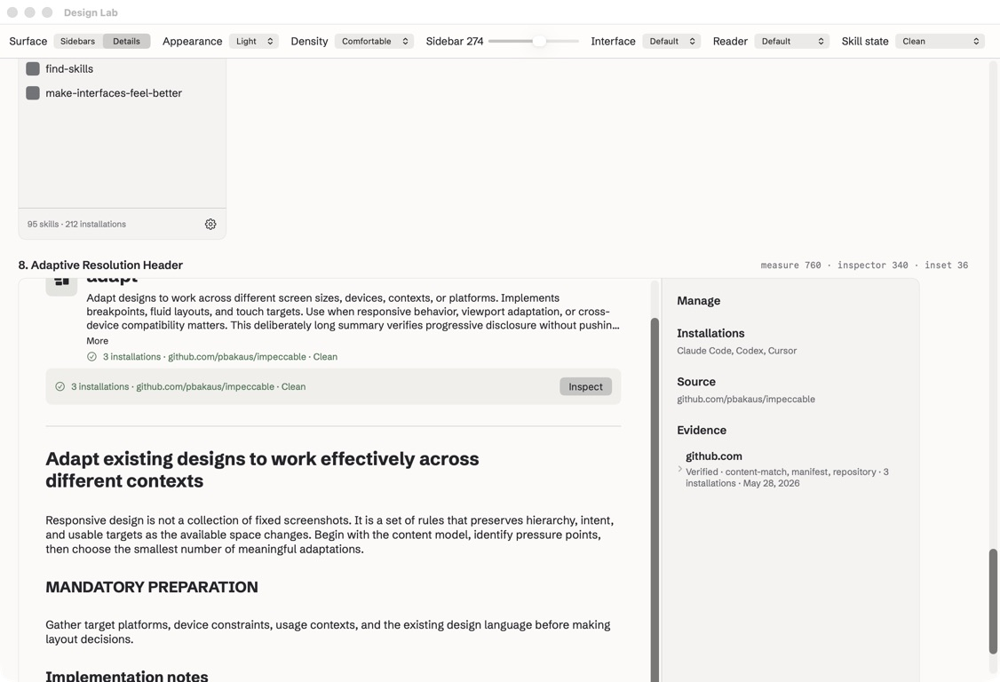
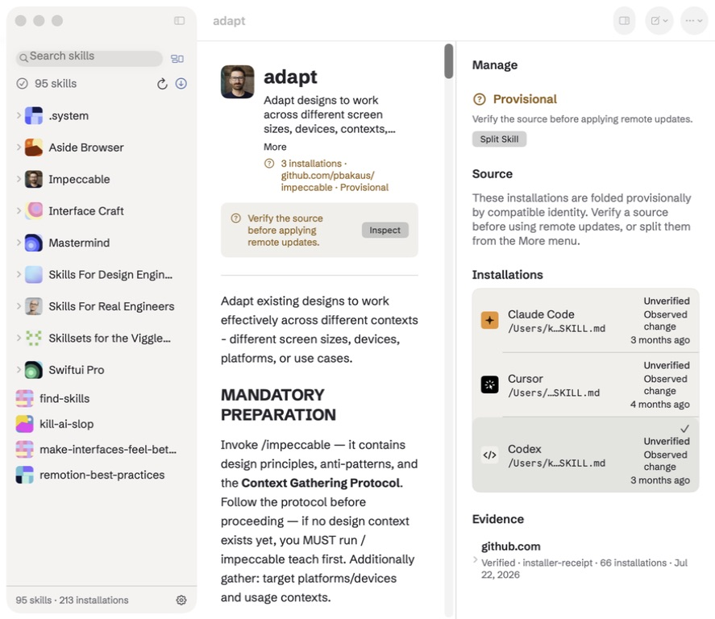

# Production design selection — July 22, 2026

## Selected concepts

- Sidebar 4: **Status-Led Header**
- Detail 8: **Adaptive Resolution Header**

## Rationale

The Status-Led Header keeps Search and Library View together as the first navigation task, then uses the second row for live library status, Scan, and Update. This removes the redundant title treatment while keeping maintenance actions visible and giving the list more room.

The Adaptive Resolution Header preserves Markdown as the primary reading surface while keeping installation and source state visible in one compact line. Management content moves to an independently scrolling trailing inspector. The inspector can be shown or hidden from the toolbar, preserves the Focused/Wide reader preferences, and elevates the relevant source or installation section when a skill is provisional, modified, updateable, conflicted, missing a source, or has multiple candidates.

Evidence is grouped by normalized source URL in the inspector and no longer expands the reader document.
