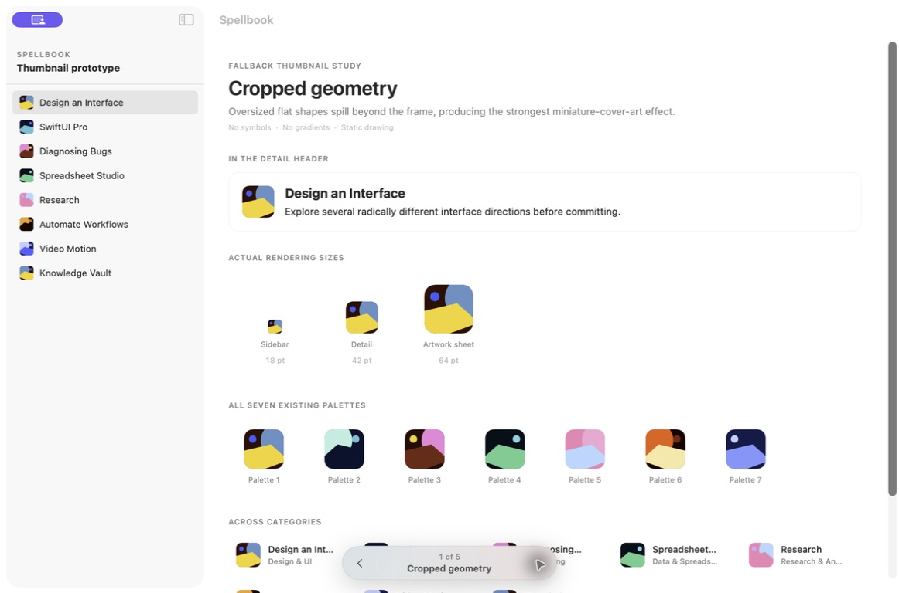
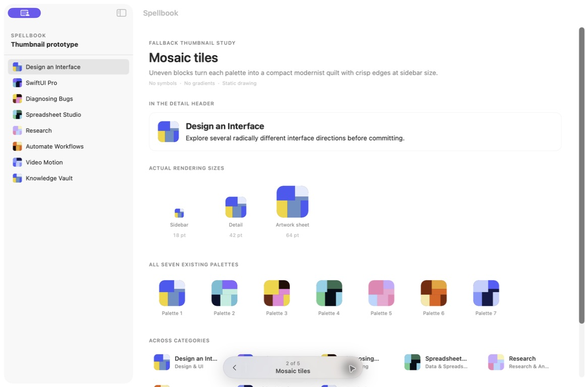
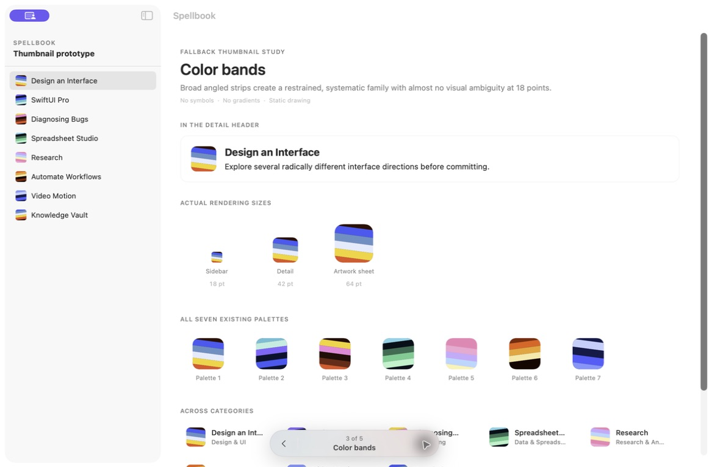
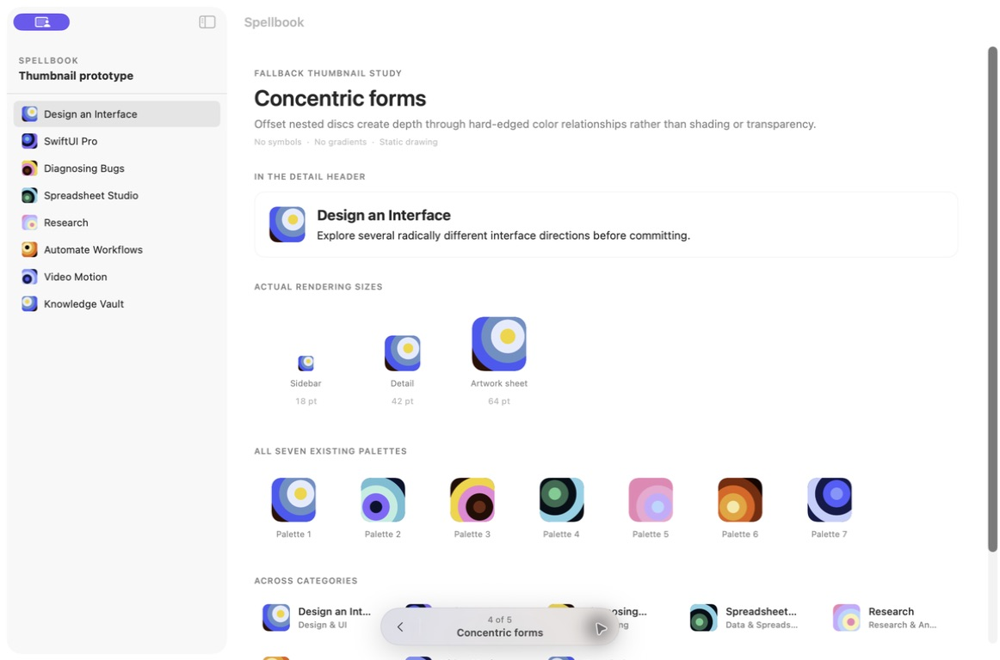
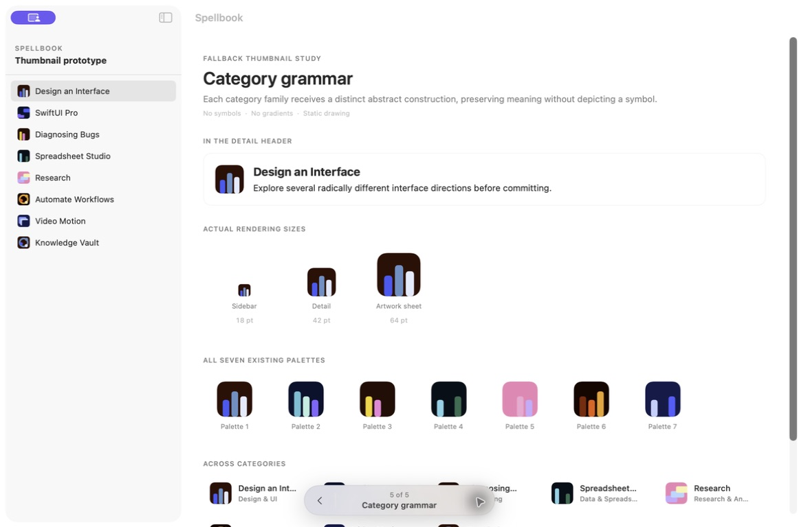
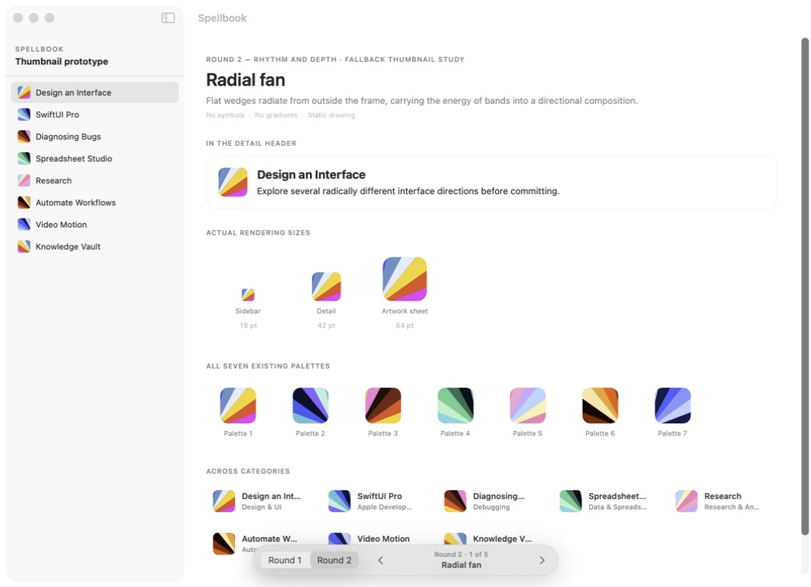
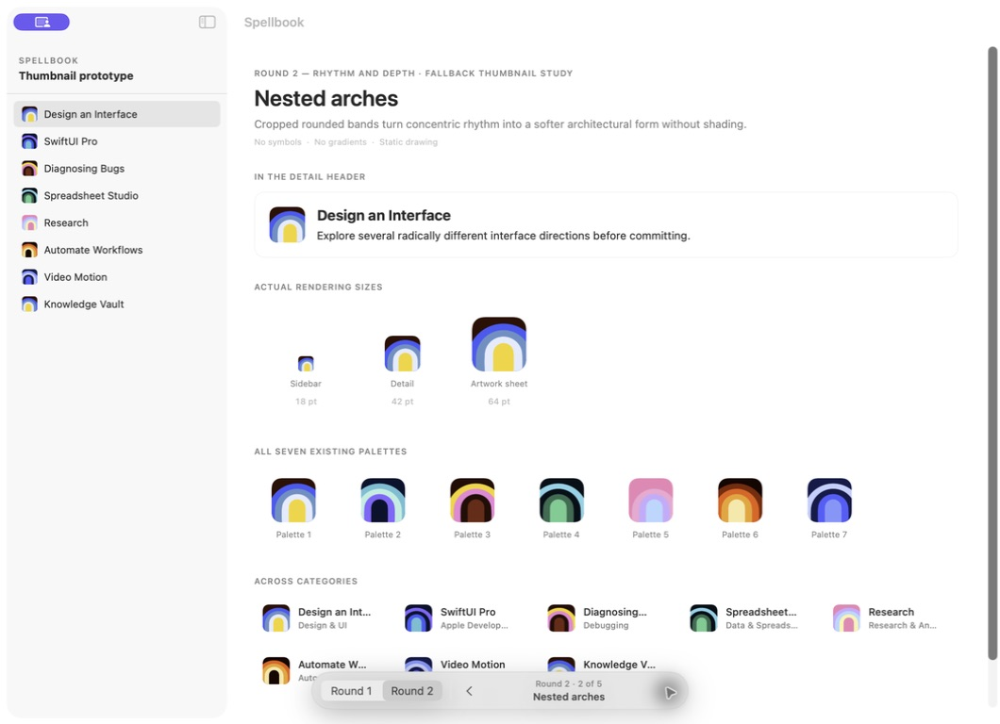
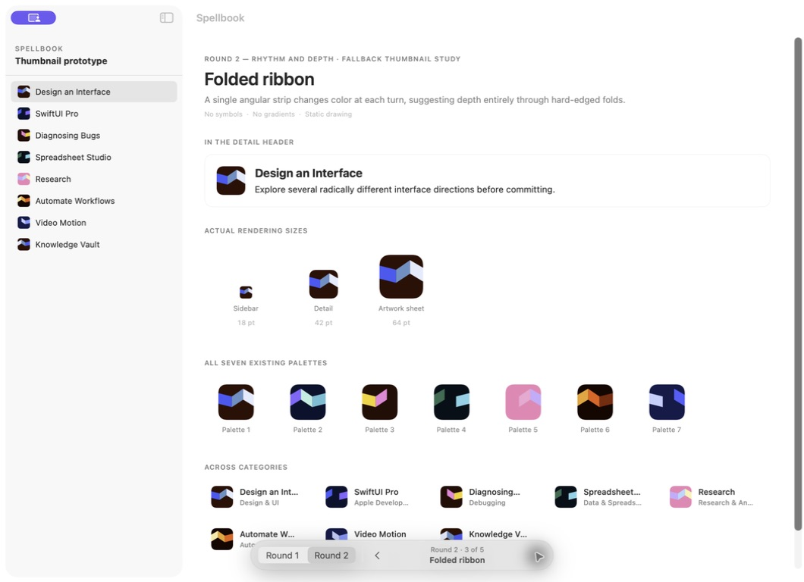
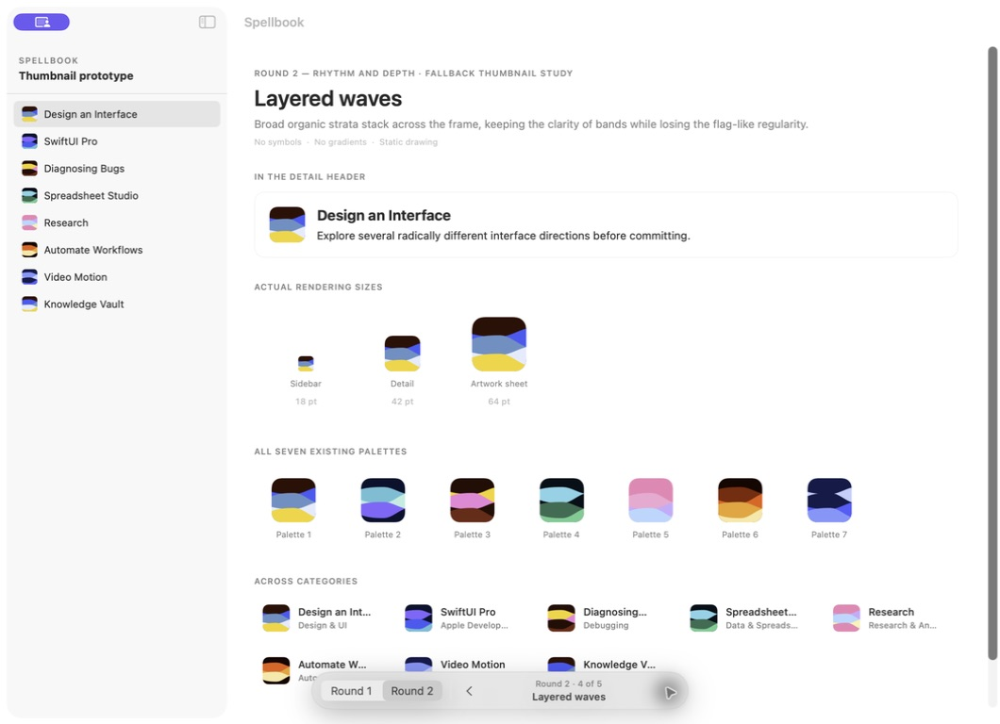
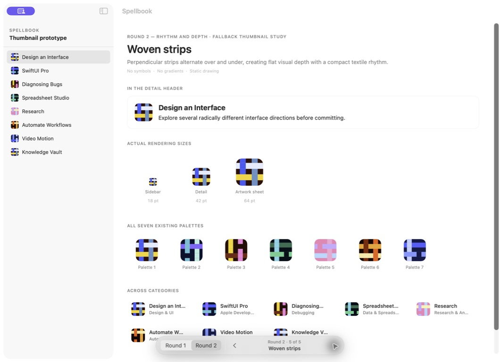

# Fallback thumbnail design decision

Question: What should replace Spellbook's generated symbol-on-gradient fallback while preserving the existing color palettes?

Decision: generated fallbacks use one of five stable abstract compositions, selected deterministically per skill:

1. Cropped geometry
2. Mosaic tiles
3. Concentric forms
4. Radial fan
5. Woven strips

The package selects a stable palette and the skill independently selects a stable composition. This produces up to 35 combinations without random changes between launches. Every composition uses flat fills in one static SwiftUI `Canvas`; generated fallbacks contain no symbol, gradient, animation, or image allocation.

The production implementation lives in:

- `FallbackThumbnailView.swift`
- `FallbackThumbnailRenderer.swift`
- `FallbackThumbnailComposition.swift`
- `FallbackThumbnailPalette.swift`

## Prototype record

The comparison gallery was removed after selection. Its captures are retained below as the primary visual record of the decision.

